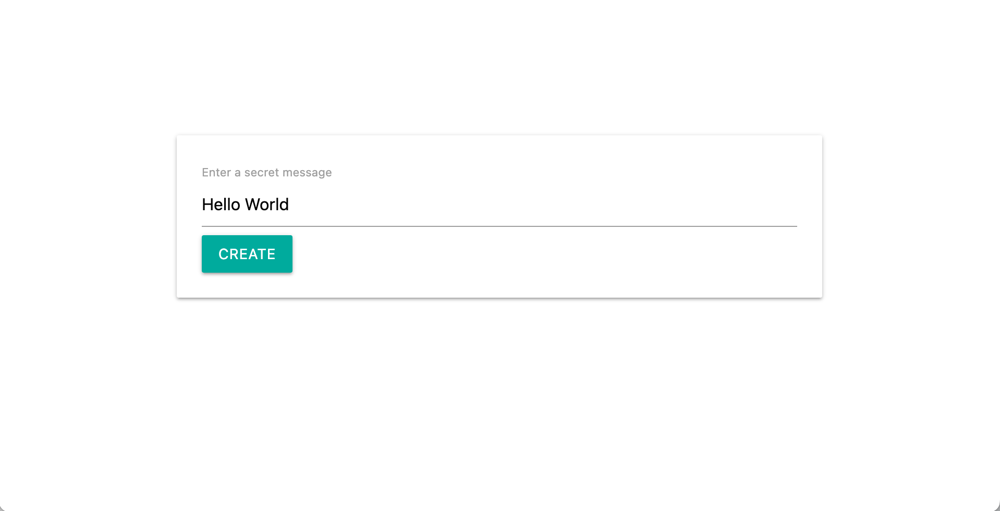
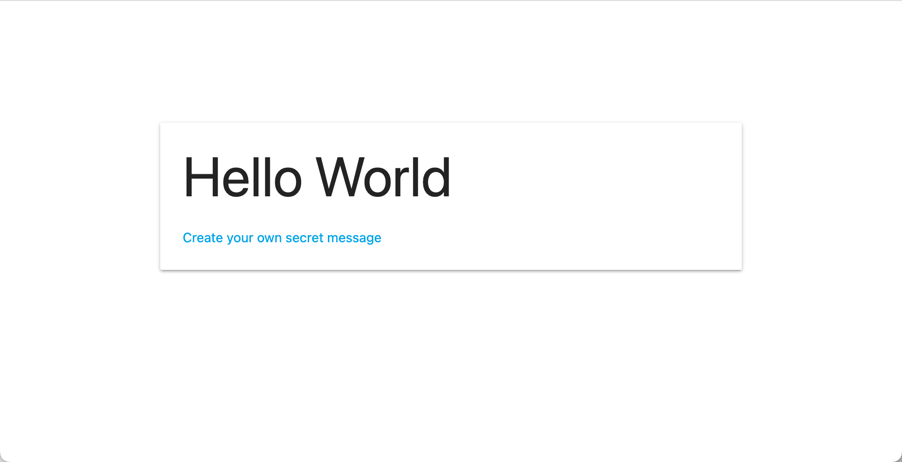

# Overview
This project is about encoding and decoding simple strings on a webpage. The message is encoded and the encoded string is appended in the URL.
This URL can be shared with a different user, which can use the URL to decode the message on his end.

## Page 1: Encode

On this page the user can enter his 'secret' message. The message is not really encrypted with a super sophisticated algorithm, but rather then that the message is encoded in Base64. The encoded string is appended to the URL and the user can share the URL with a different user.

## Page 2: Decode

On this page the user can decode the message. The encoded string is retrieved from the URL and decoded. The decoded message is displayed on the page (Page 3).

## Page 3: Decoded message

This page displays the decoded message.

# How to run the project
Follow the link to [vecsel](https://simple-encrypted-messages-lgw40p4ic-maxlell.vercel.app/) where the application can be executed, without any previous setup.

